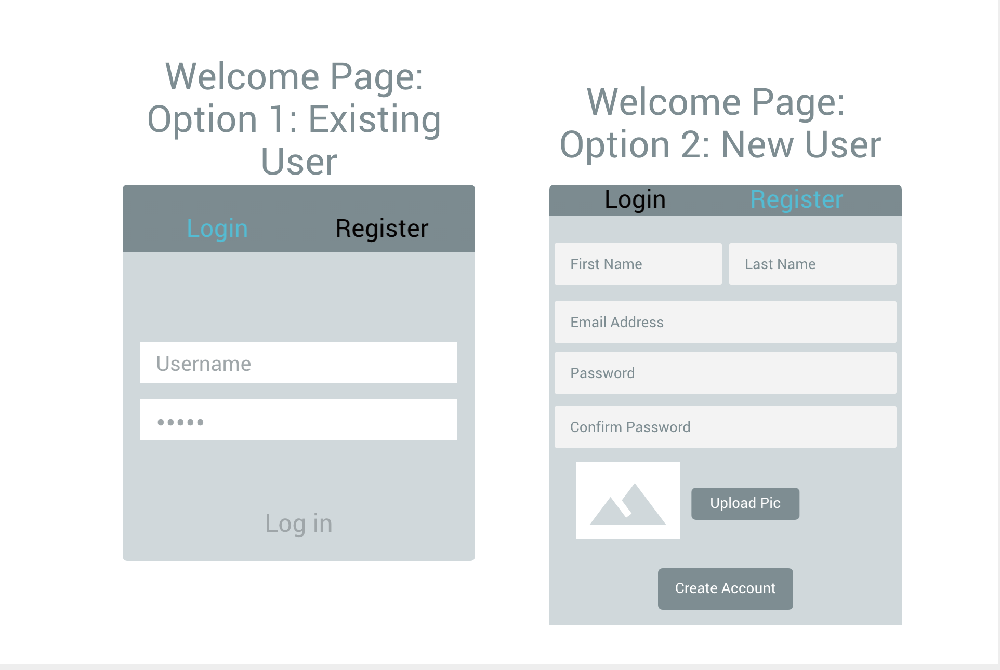
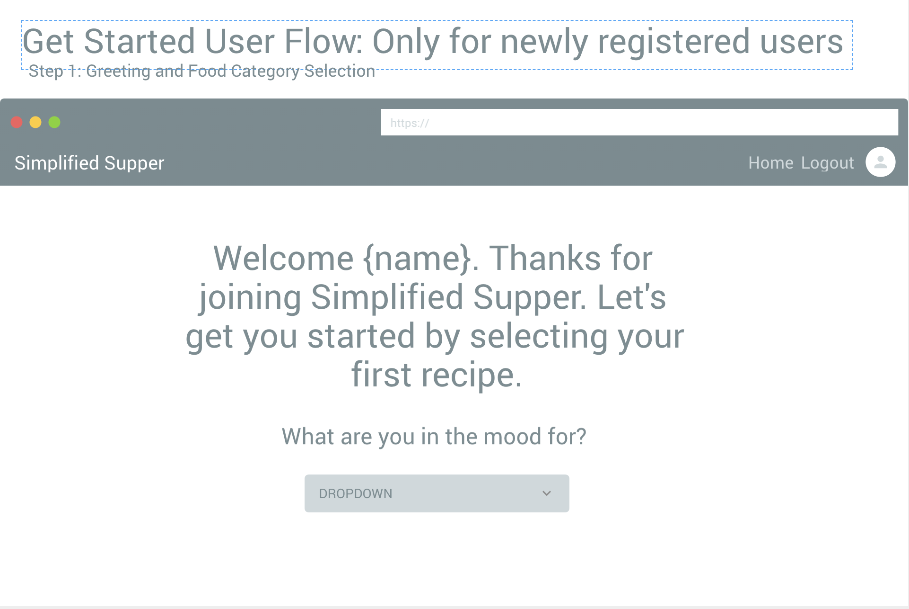
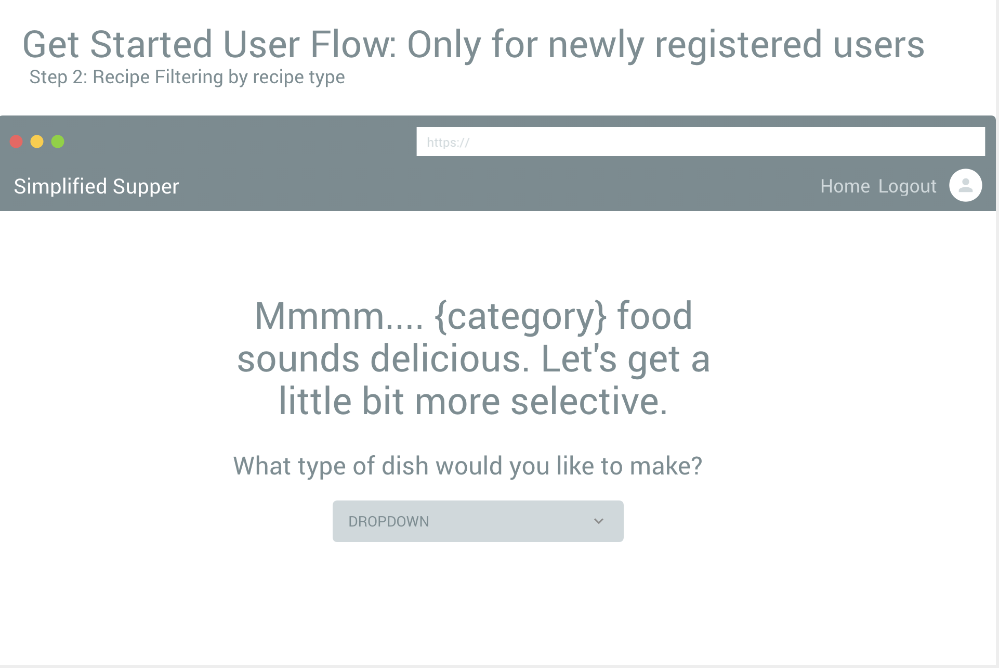
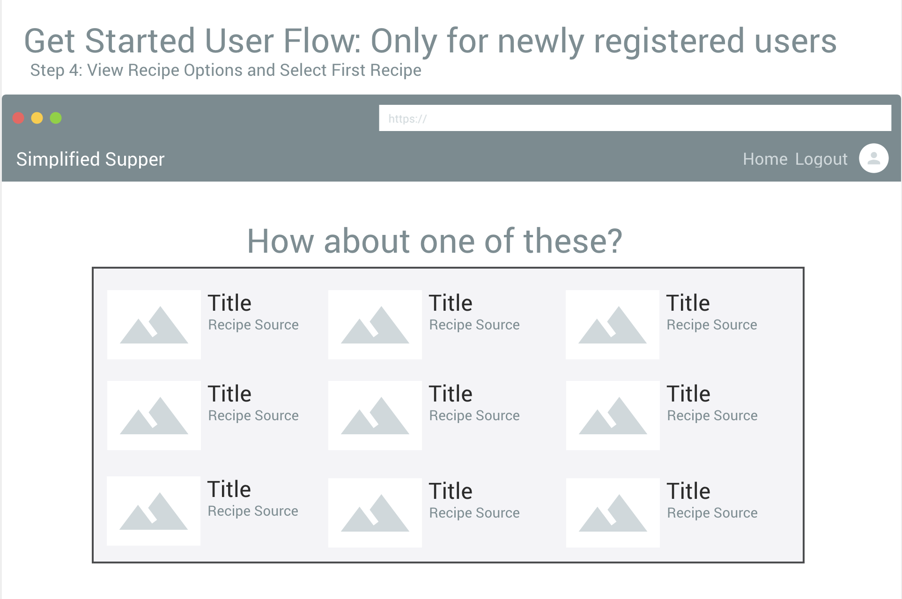
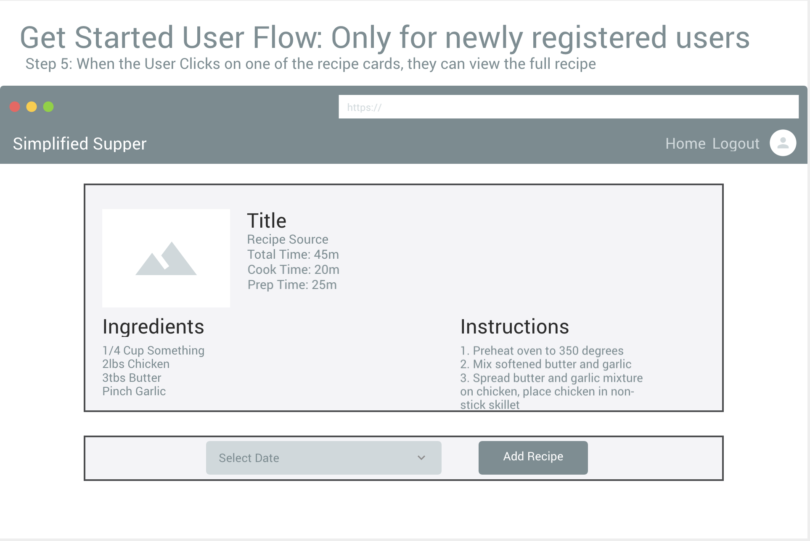
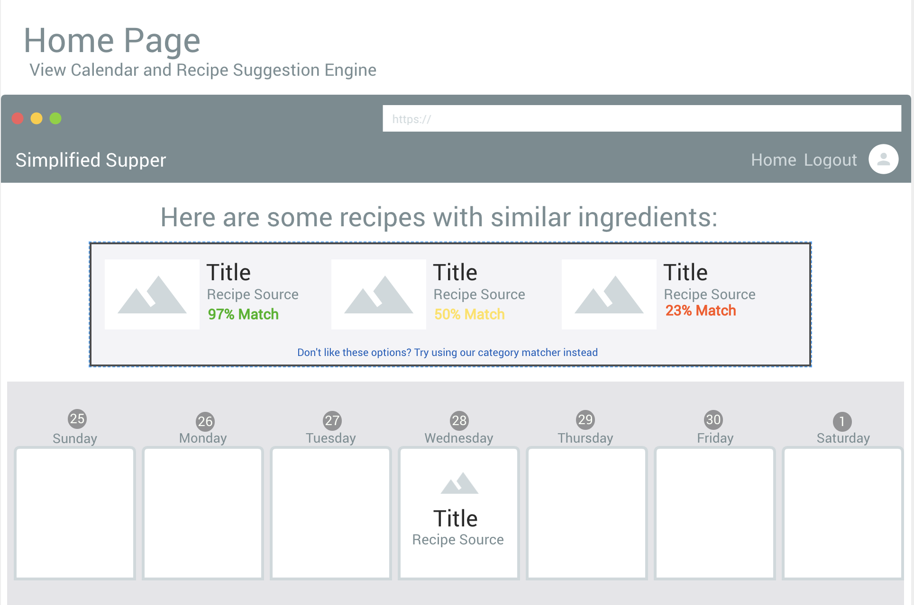

# Simplified Supper
  Simplified Supper is intended to make meal planning easy, allowing the user to see at a glance what they have coming up so grocery shopping is a breeze. By looking at the meals the user has planned for the week, Simplified Supper provides suggested recipes based on the percentage of ingredients that can be repurposed from your chosen meals.

## Table of Contents
  <!-- * [Project Requirements and Features List](#project-requirements-and-features-list) -->
  * [Technologies Used](#technologies-used)
  * [Installing and Launching Simplified Supper](#instructions-for-installing-simplified-supper)
  * [Appendix 1: Planning Documentation](#appendix-1-planning-documentation)
    * [Entity Relationship Diagrams](#entity-relationship-diagram)
    * [Wireframes](#wireframes)
  * [Appendix 2: Set Up Instructions](#appendix-2-set-up-instructions)

<!-- ## Project Requirements and Features List -->


## Technologies Used
  ### Development Languages and Libraries
  </img> </img> </img> </img>

  ### Development Tools
  <!-- TODO: Image for wireframe tool -->
  <!-- FIXME: Update image for slack, currently showing a broken link -->
  </img> </img> </img> </img>
  <!-- </img> -->

## Instructions for Installing Simplified Supper
  To launch the Simplified Supper app, you will need to have access to command line tools, node package manager, JSON Server. If you do not have access to any of these tools, you can find instructions for installing them in the [Appendix.](#appendix-2-set-up-instructions)

  Clone this repo on you personal machine using the following command
  ```sh
    git clone git@github.com:kellymorin/simplifiedSupper.git
  ```

  Install the NPM dependencies for this project using the following commands
  ```sh
    cd simplified-supper
    npm install
  ```

  From your terminal window, type
  ```sh
    npm start
  ```

  Now that the server is up and running, you can open an internet browser and access the application
  ```sh
    http://localhost:8080/
  ```

 ### Congratulations you are now experiencing Simplified Supper!

  ## Appendix 1: Planning Documentation

  ### Entity Relationship Diagram
  

  ### Wireframes/ Mockups
  </img> </img>
  </img> </img>
  </img> </img>


  ## Appendix 2: Set Up Instructions

  You will need to have command line tools installed for your computer to use terminal commands.

  Linux/ Windows users, please visit the [Git page](https://git-scm.com/book/en/v2/Getting-Started-Installing-Git) and follow the instructions for set up

  Mac users follow the instructions below

  Open your terminal and type
  ```sh
    git --version
  ```

  You will now need to configure your git account. In the terminal window, type:
  ```sh
    git config -global user.name "Your Name"
    git config -global user.email "Your Email"
  ```

  If you do not have Node.js installed on your machine, visit the [Node.js Download Page](https://nodejs.org/en/download/) and  follow the instructions. To ensure that it is installed correctly, in your terminal window, type
  ```sh
    echo $PATH
  ```
  Ensure that the result has the following in the $PATH
  ```sh
    /usr/local/bin
    or
    /usr/local/bin:/usr/bin:/bin:/usr/sbin:/sbin
  ```

  Now you can follow the [installation instructions](#instructions-for-installing-simplified-supper) to get Simplified Supper up and running on your machine.

  This project was bootstrapped with [Create React App](https://github.com/facebook/create-react-app).


